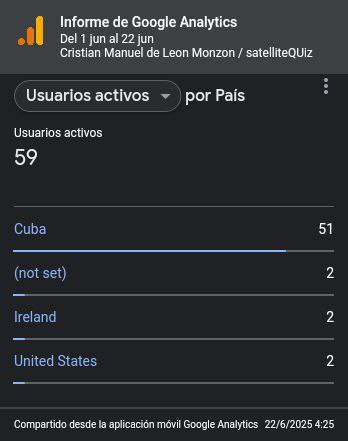
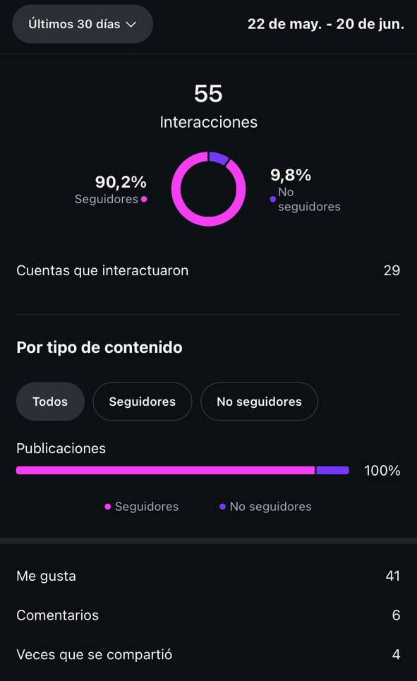
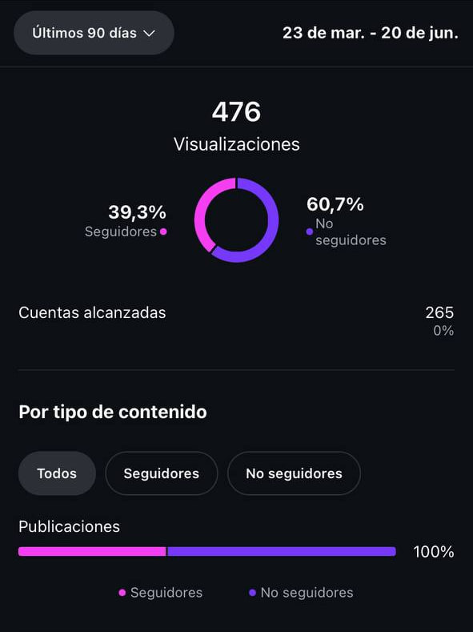

# SatelliteData

[Storytelling](https://storytellingsatellites.streamlit.app/) 

[Data Product](https://distributionofsatellites.streamlit.app/)

[Video](https://youtu.be/J3Dl7k2JuxE?si=kf3hZh_5RpQXBnmd)

## Acerca de [SatelliteQuiz](https://satellite-quiz.vercel.app/)

### Frontend desarrollado con Web Vanilla (HTML5, CSS3 y JS): https://github.com/Tnoob-dev/satelliteQuiz (En Producción)

### Backend desarrollado con FastAPI y SQLModel como ORM para trabajar con bases de datos como SQLite y PostgreSQL: https://github.com/Tnoob-dev/satelliteQuiz-Backend (En Producción)

#### _**Ambos proyectos fueron desplegados en Vercel.com**_

## Tecnologías en total usadas, contando todos los proyectos

            

## Resultados de la Campaña de comunicación

### Total de usuarios activos que llego a tener satelliteQuiz

### Interacciones totales en nuestra cuenta de Instagram

### Visualizaciones + porcentaje de usuarios que eran seguidores y no eran seguidores

